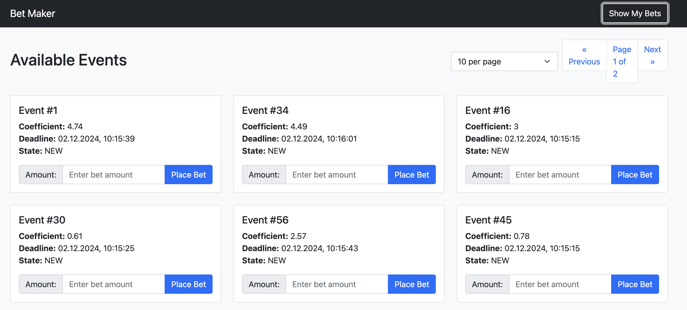
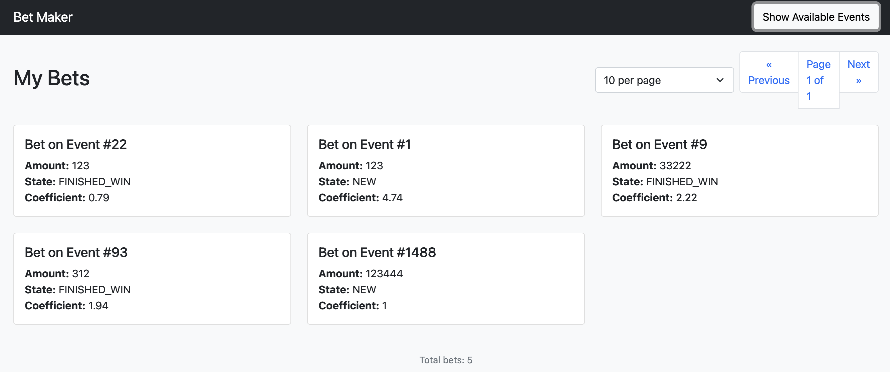

### Инструкция по развертыванию
Для развертывания приложения необходимо из корневой папки проекта выполнить команду:
```bash
docker-compose up -d
```

## Описание сервисов

### Line-Provider (Поставщик линий)

Сервис `line-provider` отвечает за управление событиями и их состояниями. По сути, это имитатор букмекерской линии.

**Основные компоненты:**
1. **API Endpoints:**
   - `PUT /event/` - создание нового события
   - `GET /event/{event_id}/` - получение информации о конкретном событии
   - `GET /events/` - получение списка всех событий

2. **Генератор событий (EventsMocker):**
   - Автоматически создает случайные события
   - Периодически генерирует новые события (каждые 10 секунд)
   - Автоматически обновляет статусы событий после дедлайна

3. **Модели данных:**
   - **Event** - основная модель события:
     - `event_id: int` - уникальный идентификатор события
     - `coefficient: PositiveFloat` - коэффициент ставки
     - `deadline: int` - время окончания приема ставок (unix timestamp)
     - `state: EventState` - состояние события (NEW, FINISHED_WIN, FINISHED_LOSE)
   - **EventState** - enum состояний события:
     - `NEW` - событие активно
     - `FINISHED_WIN` - событие завершено победой
     - `FINISHED_LOSE` - событие завершено поражением

После развертывания, схемы API доступны по адресу: `http://localhost:9909/docs`

### Bet-Maker (Сервис приема ставок)

Сервис `bet-maker` предназначен для обработки ставок пользователей и взаимодействия с Line-Provider для получения информации о событиях.

**Основные компоненты:**
1. **API Endpoints:**
   - `GET /events/` - получение списка доступных событий с пагинацией
   - `POST /bet/` - создание новой ставки
   - `GET /bets/` - получение списка ставок с пагинацией

2. **Система управления данными:**
   - Использует SQLAlchemy/SQLModel для работы с базой данных
   - Имеет систему миграций (Alembic) для управления схемой базы данных
   - CRUD операции для работы со ставками и событиями

3. **Event Polling Manager:**
   - Асинхронный менеджер для поддержания актуальности событий
   - Основные функции:
     - Периодический опрос Line-Provider для получения актуальных событий (интервал 1 секунда)
     - Кэширование событий в памяти для быстрого доступа
     - Синхронизация событий с базой данных (создание новых и обновление существующих)
     - Автоматический старт при запуске приложения и корректное завершение при остановке
   - Обработка ошибок и логирование проблем при получении данных

4. **Модели данных:**
   - **Event** (таблица в БД):
     - `event_id: int` - уникальный идентификатор события (Primary Key)
     - `coefficient: PositiveFloat` - коэффициент ставки
     - `deadline: int` - время окончания приема ставок
     - `state: EventState` - состояние события
     - `bets: List[Bet]` - связанные ставки (Relationship)

   - **Bet** (таблица в БД):
     - `bet_id: int` - уникальный идентификатор ставки (Primary Key)
     - `event_id: int` - ID связанного события (Foreign Key)
     - `amount: PositiveFloat` - сумма ставки
     - `event: Event` - связанное событие (Relationship)

   - **Вспомогательные модели**:
     - `EventOut` - модель для отображения события
     - `BetCreate` - модель для создания ставки
     - `BetOut` - модель для отображения ставки
     - `EventOutList`, `BetOutList` - модели для списков с пагинацией

5. **Основные функции:**
   - Прием и валидация ставок (проверка дедлайнов и существования событий)
   - Кэширование событий
   - Поддержание актуальности событий

После развертывания, схемы API доступны по адресу: `http://localhost:8800/docs`

**Взаимодействие между сервисами:**
1. Bet-Maker периодически опрашивает Line-Provider для получения актуальных событий
2. При создании ставки проверяется актуальность события и его дедлайн
3. Статусы событий синхронизируются между сервисами

**Технический стек:**
- FastAPI как основной фреймворк
- SQLAlchemy/SQLModel для работы с базой данных
- Alembic для миграций
- Docker для контейнеризации
- Асинхронное программирование
- REST API

### Frontend

Сервис `frontend` предназначен для отображения информации о событиях и ставках.
Там можно увидеть актуальную информацию о событиях, а также сделать ставки на них и посмотреть историю сделанных ставок.

Скриншоты:



После развертывания, интерфейс доступен по адресу: `http://localhost:8080`

### Adminer(только локально)

Для работы с базой данных доступен интерфейс Adminer по адресу `http://localhost:8081`, креды:

```
      - POSTGRES_USER=your_user
      - POSTGRES_PASSWORD=your_password
      - POSTGRES_DB=your_db_name
      - POSTGRES_SERVER=db
